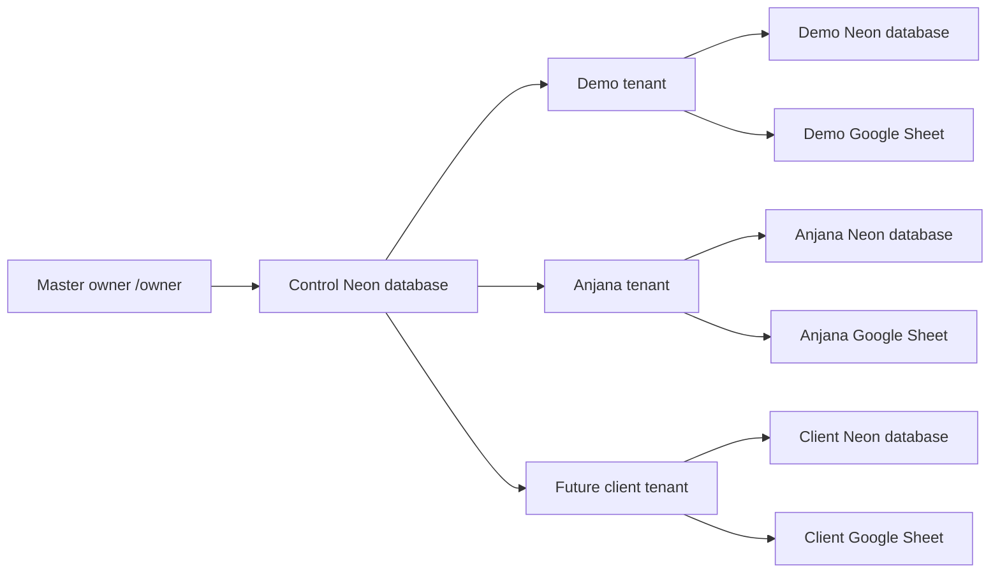

# StudioFlow Editing Lab

StudioFlow is a multi-client production and billing system for video-editing studios. One SvelteKit application serves:

- the master owner control panel;
- a separate admin workspace for every editing studio;
- private editor work portals;
- private customer status, invoice, receipt, and delivery portals;
- Neon database storage and a readable Google Sheets mirror.

Production: <https://editing-lab-new.vercel.app>

The application is hosted on **Vercel**. Neon hosts PostgreSQL databases. Cloudflare hosting, Workers, Pages, Wrangler, and OpenAI Sites are not used.

## Read this first

There are two database levels:

1. The **control database** stores the master owner, client logins, sessions, tenant status, Sheet IDs, and encrypted tenant Neon URLs.
2. Every client has a separate **tenant database** containing only that studio's customers, editors, orders, tasks, payments, invoices, settings, and sync queue.

Never use the control database as a client's order database. Never point two active clients at the same Neon database or Google Sheet.



The signed-in session selects the tenant on the server. Browser forms and API requests cannot submit a database or tenant selector.

## Technology used

| Technology | What it does |
| --- | --- |
| Svelte 5 | Pages, components, forms, reactive UI, portals |
| SvelteKit 2 | Routing, server loads, API endpoints, sessions |
| TypeScript | Shared types and safer business logic |
| Vite 8 | Development server and production bundling |
| `@sveltejs/adapter-vercel` | Packages SvelteKit for Vercel |
| Vercel | Production hosting and environment variables |
| Neon PostgreSQL | Control database and isolated tenant databases |
| Google Sheets API | Per-tenant readable workbook mirror |
| Google service account | Server-to-Sheets authentication |
| ExcelJS | Downloadable styled `.xlsx` export |
| Lucide Svelte | Interface icons |
| Web Crypto API | Password hashing, token hashing, AES-GCM encryption |

## User roles and links

| User | Entry URL | Access |
| --- | --- | --- |
| Master owner | `/owner/login` | Add clients, change client login/connections/status, reset demo |
| Client administrator | `/login` | Customers, editors, orders, tasks, billing, invoices, settings, Sheets |
| Customer | `/portal/{slug}/customer/{token}` | Own active orders, billing, invoices, receipts, approved output |
| Editor | `/portal/{slug}/editor/{token}` | Assigned active tasks, links, device, progress, duration, output |

Old `/customer/{token}` and `/editor/{token}` links are supported only for the registered legacy Anjana tenant.

## Main admin workflow

1. Create or open a customer.
2. Create an order connected to that customer.
3. Add tasks to the order.
4. Assign each task to an editor and select/add the device given to them.
5. Send the editor assignment through WhatsApp; it includes their private portal.
6. The editor updates status, progress, edited video duration, notes, and output/Drive link.
7. The admin reviews the work and chooses manual billing or duration billing.
8. Add a manual/percentage discount, record payments, and generate an invoice.
9. Send the invoice through WhatsApp; the customer gets the current private portal/invoice link.
10. Mark delivery and keep the order as history, or archive it when it should leave active lists.

## Data rules that must remain consistent

### Customer identity and phone

- Customer **studio name** is the main business identity.
- A phone is valid only when it contains exactly 10 Indian local digits. An entered `+91` prefix is accepted and removed before storage.
- Duplicate customer phone numbers are rejected, including numbers on archived customers.
- Duplicate editor phone numbers are rejected separately.
- Editing a customer's studio name or phone also updates every linked order.
- WhatsApp, invoice pages, portal pages, templates, and Sheet snapshots use the current customer record.
- Generated invoice money remains an immutable snapshot even when customer contact details later change.

Phone logic is centralized in `src/lib/phone.ts`. Do not create a second phone validator in a component.

### Archive and restore

Archive is reversible and keeps history:

- Customers: **Customers → Archived → Restore**.
- Orders: **Orders → Archived orders → Restore**.
- Editors: **Editors → View archived → Restore**.
- Tasks: open an order, view archived tasks, then restore.

Archived customer/editor portal tokens stop resolving. Restoring reactivates the existing record. Permanent deletion is a separate confirmed operation and is only available for supported archived records.

Invoices use `draft`, `sent`, `paid`, and `cancelled` instead of archive/unarchive.

### Order status

Order progress and most workflow status are recalculated from active tasks in `updateOrderSummary()` inside `src/lib/server/repository.ts`.

- no task activity → Received/Assigned;
- task progress → Editing;
- editor submits for review → Waiting Review;
- revision → Revision;
- all tasks complete → Ready Delivery;
- admin delivery → Delivered.

Do not update a task in a new route without calling the repository functions, because order totals, activity, notifications, and Sheets would become stale.

### Billing

- **Manual billing:** admin enters the subtotal.
- **Duration billing:** `hourly rate × edited video minutes ÷ 60`.
- Video duration is optional for the editor and stored in minutes.
- Admin chooses percentage or manual-amount discount.
- Payments are a ledger; invoice values are snapshots.
- Partial invoices include completed uninvoiced task values.
- Editors do not choose the customer billing method.

Duration parsing/calculation is in `src/lib/duration.ts`. Invoice creation is in `src/routes/api/orders/[id]/invoice/+server.ts`.

## WhatsApp messages

Templates are saved per tenant in **Settings → Message templates**. The code defaults live in `src/lib/messageTemplates.ts`; message/link assembly lives in `src/lib/server/whatsapp.ts`.

Editor assignment placeholders:

```text
{{editor_name}}
{{studio_name}}
{{project}}
{{customer}}
{{task_list}}
{{portal_link}}
```

Invoice placeholders:

```text
{{studio_name}}
{{studio_address}}
{{studio_phone_line}}
{{gstin_line}}
{{invoice_number}}
{{customer}}
{{project}}
{{event}}
{{delivery_date}}
{{total}}
{{paid}}
{{balance}}
{{payment_note}}
{{invoice_footer_line}}
{{portal_link}}
```

Keep `{{portal_link}}` in customer invoice templates. WhatsApp opens a `wa.me` link; the application does not silently send messages through a paid WhatsApp Business API.

## Google Sheets behavior

Neon is the source of truth. Google Sheets is a formatted mirror and reporting workspace.

Standard tabs:

- Orders
- Customers
- Editors
- Tasks
- Payments
- Invoices
- Activity Logs
- Settings

Important database writes create an outbox record. After the database succeeds, StudioFlow flushes a fresh workbook snapshot. If Google is temporarily unavailable, the outbox remains pending and can retry later.

Do not manually create live operational records only in Sheets. The supported import is for historical orders, and editor reconciliation can archive database editors removed from the Editors Sheet.

Dates are formatted for Indian operations and times use 12-hour Asia/Kolkata display rules.

## Theme behavior

Each tenant has its own default theme settings. A browser's selected palette is stored using the tenant slug, so changing Demo does not recolor Anjana or another client. Theme code is in `src/lib/theme.ts`.

## Project folders: where to change things

```text
db/
  control-schema.ts       Master owner/client/session tables
  schema.ts               Tables created inside every client database

scripts/
  control-db.mjs          Manual control migration/bootstrap helper
  audit-tenancy.mjs       Release check for tenant-safe server routes

src/hooks.server.ts       Global authentication, roles, tenant gate, CSRF check
src/lib/types.ts          Shared customer/editor/order/task/invoice types
src/lib/phone.ts          10-digit Indian phone normalization/validation
src/lib/duration.ts       Duration parsing and duration-billing formula
src/lib/identifiers.ts    Order/editor prefixes and readable numbers
src/lib/messageTemplates.ts Default editor/customer WhatsApp templates
src/lib/theme.ts          Tenant-scoped palette selection

src/lib/server/control.ts Master accounts, tenants, encryption, passwords, sessions
src/lib/server/db.ts      Neon adapter and tenant schema initialization
src/lib/server/repository.ts All tenant business reads/writes and propagation
src/lib/server/googleSheets.ts Sheet authentication, formatting, sync, import
src/lib/server/portals.ts Safe customer/editor portal data loaders
src/lib/server/tokens.ts  Portal token creation, hashing, encryption
src/lib/server/whatsapp.ts Current-data message and wa.me link generation
src/lib/server/demo.ts    Resettable fictional demo seed
src/lib/server/exportWorkbook.ts Styled Excel export
src/lib/server/maintenance.ts Retention and storage warnings
src/lib/server/validation.ts External Drive/image/output URL validation

src/lib/components/       Reusable shell, modal, order, customer, editor UI
src/routes/(admin)/       Signed-in client pages
src/routes/api/           Authenticated mutations and portal task update API
src/routes/owner/         Master owner control panel
src/routes/customer/      Shared customer portal UI
src/routes/editor/        Shared editor portal UI
src/routes/portal/        Tenant-slug portal entry and invoice pages
```

SvelteKit route naming:

- `+page.svelte` is the visible page.
- `+page.server.ts` loads protected server data or handles form actions.
- `+server.ts` is an API endpoint.
- `[id]`, `[token]`, and `[slug]` are URL parameters.
- `(admin)` is a route group; it does not appear in the URL.

### Reusable component guide

| Component | What it is used for |
| --- | --- |
| `AppShell.svelte` | Signed-in admin navigation, search, notifications, mobile menu, and page frame |
| `Modal.svelte` | Shared accessible popup; closes on Escape/backdrop and locks background scrolling |
| `NewCustomerModal.svelte` | Creates or edits a customer, validates the phone, and shows the customer portal link |
| `EditorModal.svelte` | Creates or edits an editor, assigned devices, links, and editor portal access |
| `NewOrderModal.svelte` | Creates an order for a selected customer with the initial project details |
| `TaskModal.svelte` | Assigns or edits work, editor, device, source link, due date, and instructions |
| `BillingModal.svelte` | Sets the order total using manual or duration billing and applies a fixed/percentage discount |
| `PaymentModal.svelte` | Records a customer payment against an order |
| `InvoiceModal.svelte` | Reviews invoice totals and chooses the invoice calculation before creation |
| `DeliveryModal.svelte` | Records the final delivery link and delivery action |
| `PageHeader.svelte` | Standard admin page title, description, and main action |
| `PortalHeader.svelte` | Branded heading shared by customer and editor portals |
| `StatusBadge.svelte` | Consistent colored status label |
| `WhatsAppIcon.svelte` | Reusable WhatsApp symbol for chat/send actions |

Every component file also starts with a short purpose comment. Larger components contain section comments around state, actions, and responsive behavior.

### Page and route guide

| URL or route folder | Purpose |
| --- | --- |
| `/dashboard` | Summary cards, recent work, billing, and operational warnings |
| `/customers` | Create, edit, archive, restore, message, and open customer portals |
| `/orders` | Customer-first order list with archive/restore controls |
| `/orders/[id]` | One order's sticky identity, tasks, editors, billing, payments, invoice, delivery, and activity |
| `/editors` | Editor profiles, devices, archive/restore, portal links, and update notifications |
| `/invoices` | Invoice list with newest records first |
| `/invoices/[id]` | Printable invoice detail and send/download actions |
| `/settings` | Tenant identity, prefixes, templates, devices, event options, theme, and integrations |
| `/settings/sheets` | Full spreadsheet-style views, sync, reconciliation, and historical import |
| `/owner` | Master control panel for tenant databases, credentials, storage, and lifecycle |
| `/portal/[slug]/customer/[token]` | Private customer portal with invoices and receipts |
| `/portal/[slug]/editor/[token]` | Private editor work portal with progress, duration, notes, and output link |

For a page, `+page.svelte` controls what is visible and its nearby `+page.server.ts` fetches protected data. Each of these files starts with a purpose note.

### API guide

All admin APIs require an authenticated tenant session. The tenant database comes from the signed-in session, never from a browser-supplied database URL.

| API group | What it changes |
| --- | --- |
| `/api/customers` | Customer create/update/archive/restore and related current contact data |
| `/api/editors` | Editor create/update/archive/restore, reconcile, and WhatsApp portal messages |
| `/api/orders` | Order create/update/archive/restore and customer WhatsApp choices |
| `/api/orders/[id]/tasks` and `/api/tasks/[id]` | Task assignment and later task edits |
| `/api/orders/[id]/payments` | Payment recording |
| `/api/orders/[id]/invoice` | Invoice calculation and generation |
| `/api/invoices/[id]` | Invoice status and delivery state |
| `/api/invoices/[id]/whatsapp` | Current customer number, invoice PDF/link, and portal message |
| `/api/portal/[slug]/tasks/[id]` | Token-protected editor progress, duration, notes, and output updates |
| `/api/notifications` | Admin notification read/count operations |
| `/api/settings` and `/api/event-options` | Tenant-specific settings, devices, templates, and event lists |
| `/api/sheets/sync` and `/api/sheets/import` | Google Sheets synchronization and controlled historical import |
| `/api/export` | Downloadable workbook generated from the current tenant database |

### How to read function names

The main business functions live in `src/lib/server/repository.ts`. Their first word tells you what they do:

- `list...` returns multiple records; `get...` returns one record.
- `create...` inserts a new record; `update...` changes an existing record.
- `archive...` hides a record without deleting it; `restore...` makes it active again.
- `record...` adds history such as a payment, activity, or notification.
- `load...` assembles safe data for a page or portal.
- `sync...`, `flush...`, and `queue...` move changes between the database and Google Sheets.
- `build...` prepares a message, link, invoice, or export without changing unrelated records.

Complex functions have comments at business boundaries—for example authentication, tenant selection, phone propagation, billing, invoice snapshots, sheet sync, encryption, and portal security. Very small assignments are intentionally left self-explanatory so comments do not repeat every line.

## Environment variables

Copy `.env.example` to `.env.local` for local development. Real `.env.local` values must never be committed or pasted into screenshots/messages.

| Variable | Required | Source/purpose |
| --- | --- | --- |
| `CONTROL_DATABASE_URL` | Yes | Pooled Neon URL for the master control database |
| `OWNER_BOOTSTRAP_EMAIL` | First setup | Master email created only when no owner exists |
| `OWNER_BOOTSTRAP_PASSWORD` | First setup | Temporary owner password, minimum 10 characters |
| `CONFIG_ENCRYPTION_KEY` | Yes | Encrypts saved tenant database URLs, minimum 24 characters |
| `SESSION_SECRET` | Yes | Sessions and encrypted portal-token copies, different 24+ character value |
| `GOOGLE_SERVICE_ACCOUNT_EMAIL` | Sheets | Google service-account email shared with every workbook |
| `GOOGLE_SERVICE_ACCOUNT_PRIVATE_KEY` | Sheets | Full private key; preserve `\n` line breaks |
| `PUBLIC_APP_URL` | Yes | Local: `http://localhost:5173`; production: live Vercel URL |
| `DATABASE_STORAGE_LIMIT_MB` | Optional | Warning baseline; defaults to 500 MB |

Legacy variables (`DATABASE_URL`, `ADMIN_EMAIL`, `ADMIN_PASSWORD`, `GOOGLE_SHEETS_ID`, `GOOGLE_SHEETS_ORDERS_TAB`) are only for the one-time Anjana registration.

Generate two different secrets manually:

```sh
node -e "console.log(require('crypto').randomBytes(32).toString('base64url'))"
node -e "console.log(require('crypto').randomBytes(32).toString('base64url'))"
```

Use one output for `CONFIG_ENCRYPTION_KEY` and the other for `SESSION_SECRET`.

Important: changing `CONFIG_ENCRYPTION_KEY` makes existing encrypted tenant database URLs unreadable. Re-enter every client Neon URL after an accidental rotation. Changing `SESSION_SECRET` invalidates sessions and may require regenerating portal links whose encrypted copies can no longer be opened.

## Local setup, step by step

1. Install Node.js 20 or newer and Git.
2. Open the repository folder.
3. Install packages:

   ```sh
   npm install
   ```

4. Create `.env.local` from `.env.example`.
5. In Neon, choose the `main` branch, the control database, `neondb_owner`, and a pooled connection string. Put it in `CONTROL_DATABASE_URL`.
6. Add two different generated secrets.
7. Add temporary owner email/password if the control database has no owner.
8. Add Google service-account values when Sheets are required.
9. Set `PUBLIC_APP_URL=http://localhost:5173`.
10. Start the application:

    ```sh
    npm run dev
    ```

11. Open <http://localhost:5173/owner/login> or <http://localhost:5173/login>.

Local may use the production `main` databases for a true live view, but every local action then changes production client data. Use a Neon branch/database when testing destructive operations or demo resets.

## Getting Google service-account values manually

1. Create/select a Google Cloud project.
2. Enable the Google Sheets API.
3. Create a service account.
4. Create a JSON key for that service account and download it once.
5. Copy `client_email` into `GOOGLE_SERVICE_ACCOUNT_EMAIL`.
6. Copy the complete `private_key` into `GOOGLE_SERVICE_ACCOUNT_PRIVATE_KEY`.
7. Share every client Google Sheet with the service-account email as **Editor**.

In Vercel, paste the private key as one environment value. Keep the BEGIN/END lines and newline escapes. Never commit the JSON key.

## First owner setup

With `.env.local` configured:

```sh
npm run control:migrate
npm run control:bootstrap
```

Sign in at `/owner/login`. Once the master login works, remove `OWNER_BOOTSTRAP_PASSWORD` from local/production environments. Change the master password inside the owner panel when needed.

`OWNER_BOOTSTRAP_EMAIL` and `OWNER_BOOTSTRAP_PASSWORD` do not overwrite an existing owner. If credentials already exist, use the owner panel or update the intended control account safely.

## Add a new client manually

1. Create a new empty Neon database for that client.
2. Create a new Google Sheet for that client.
3. Share the Sheet with the service account as Editor.
4. Sign in to `/owner`.
5. Choose **Add client**.
6. Enter internal name, URL slug, studio name/logo, client login, Neon URL, Sheet ID, and Orders tab.
7. Enable demo only for a fictional resettable workspace.
8. Confirm password twice.
9. StudioFlow validates duplicate connections, database compatibility, and Sheet access.
10. Give the client only the normal `/login` URL and their client-admin credentials.

Never give a client the owner login, service-account JSON, Neon URL, encryption key, or another client's Sheet.

## Manual owner operations

- Change a client email/password: `/owner` → client → login credentials. Existing sessions are revoked.
- Change database/Sheet: `/owner` → client → connections. Confirm the replacement Neon URL twice.
- Keep current Neon URL: leave the replacement URL blank.
- Test services: use **Test connections**.
- Suspend access: set status to `suspended`; sessions are revoked.
- Reactivate: connection/schema/Sheet checks must pass.
- Reset demo: only a demo tenant shows this action, and confirmation must be exactly `RESET`.

## Manual code-change guide

| Desired change | Start here | Also check |
| --- | --- | --- |
| Customer fields/rules | `types.ts`, customer modal, repository customer functions | customer APIs, Sheets columns, export, portals |
| Editor fields/rules | `types.ts`, editor modal, repository editor functions | editor APIs, tasks, Sheets, portal |
| Order fields/status | `types.ts`, order modal/detail, repository order functions | dashboard, customer portal, Sheets, export |
| Task/editor workflow | task modal, repository task functions | portal task API, editor portal, notifications |
| Billing formula | `duration.ts`, invoice API | invoice modal/page, Sheets, WhatsApp |
| WhatsApp wording | Settings or `messageTemplates.ts` | `whatsapp.ts`, placeholder list |
| Phone rule | `phone.ts` | database unique index and demo data |
| Prefixes | Settings and `identifiers.ts` | Sheets/export/invoices |
| Theme | `theme.ts`, `layout.css` | tenant-scoped storage key |
| Database table | `db/schema.ts` | repository mapping, Sheets, export, demo seed |
| Owner/control data | `db/control-schema.ts`, `control.ts` | owner actions and environment docs |

When adding a field, update every layer in this order:

1. shared TypeScript type;
2. database schema/migration;
3. row-to-object mapping in the repository;
4. create/update repository function;
5. API validation;
6. admin form/display;
7. portals if the field is public;
8. Sheets/export columns;
9. demo seed;
10. checks and production verification.

## Commands

```sh
npm run dev               # local live server
npm run check             # TypeScript + Svelte diagnostics
npm run test:tenancy      # tenant-boundary static audit
npm run build             # production Vercel build
npm run control:migrate   # initialize/update control schema
npm run control:bootstrap # create first owner/legacy tenant when configured
npx vercel --prod         # manual production deployment
```

Release checklist:

```sh
npm run check
npm run test:tenancy
npm run build
git diff --check
```

On Windows without Developer Mode, the Vercel adapter's final local symbolic-link step may fail after both client/server bundles compile. Vercel's Linux build environment supports the link. A successful Vercel production build remains the final packaging check.

## Vercel deployment

See [VERCEL_SETUP.md](./VERCEL_SETUP.md) for the focused hosting checklist.

Normal deployment:

1. Push the tested commit to the Git branch connected to Vercel Production; or
2. from this already-linked folder run:

   ```sh
   npx vercel --prod
   ```

Required production variables must be added to the correct Vercel environments. Production `PUBLIC_APP_URL` should be `https://editing-lab-new.vercel.app` unless a final custom domain replaces it.

## Security model

- Passwords use salted PBKDF2-SHA256 hashes; plain passwords are not stored.
- Tenant database URLs use AES-GCM encryption.
- Session and portal URL tokens are random and stored as hashes for authentication.
- Session cookies are HTTP-only, secure on HTTPS, and SameSite Lax.
- Login attempts are rate-limited.
- Mutating requests with a foreign Origin are rejected.
- Public portal tokens are tenant-scoped and archived records are blocked.
- Editor portals do not receive internal billing rates/settlement fields.
- External task links accept only HTTP(S), reject embedded credentials, and have length limits.
- Owner summaries never return the full Neon URL/password to the browser.

Do not log or display `.env.local`, database connection strings, service-account keys, session cookies, or full customer/editor portal tokens.

## Troubleshooting

### `CONTROL_DATABASE_URL is required`

Create `.env.local`, add the pooled control Neon URL, save, and restart `npm run dev`.

### `OperationError` after rotating encryption keys

The saved tenant Neon URLs were encrypted with the previous `CONFIG_ENCRYPTION_KEY`. Restore the exact previous key or re-enter each tenant connection through a safe recovery process.

### Owner credentials are incorrect

Bootstrap values create an owner only when none exists. They do not reset an existing account. Use the owner password change flow or intentionally update the control account.

### Google authentication/private-key error

Check the complete BEGIN/END private-key value, newline handling, enabled Sheets API, and that the workbook is shared with the service-account email as Editor.

### Sheet changes do not appear

Neon is authoritative. Open Settings/Sheets, check connection/sync state, retry sync, and confirm the correct tenant Sheet ID.

### Customer number changed but an old invoice message is displayed

The invoice page may show the historical message stored when it was generated. Clicking **Send in WhatsApp** creates a fresh message using the current customer profile while preserving invoice money.

### Portal link returns 404

The tenant/customer/editor may be archived or suspended, or the link token was regenerated. Restore/reactivate as appropriate and copy the latest portal link.

### Chrome hydration/extension error

Try Incognito with extensions disabled and hard refresh. If the error disappears, an extension modified the page. Also run `npm run check` to rule out an application compile issue.

### Local Vercel build symlink error

Enable Windows Developer Mode/run with suitable permissions, or rely on the successful Vercel production build after `npm run check` passes.

## Safe recovery

- Lost client password: reset in `/owner`; sessions are revoked.
- Suspicious client access: suspend tenant, reset credentials, test connections, reactivate.
- Broken tenant connection: replace/test only that client's connection.
- Database restore: restore only the affected tenant database.
- Demo corruption: use owner **Reset demo data**; never point reset at a real client.
- Sheet corruption: keep Neon unchanged and rewrite the tenant Sheet snapshot.

Before any permanent deletion, export data and confirm the exact tenant and record. Prefer archive/restore for normal operations.
